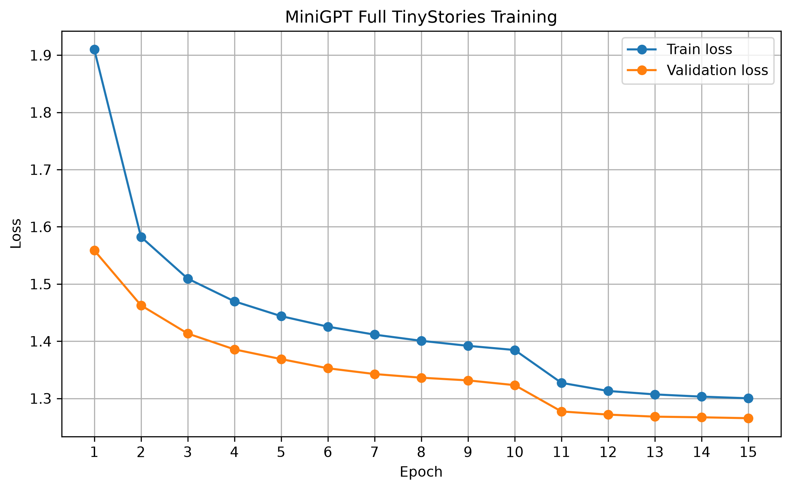

# MiniGPT

A decoder-only Transformer language model implemented from scratch with PyTorch and trained on the TinyStories dataset.

The project covers the complete language-model pipeline: SentencePiece tokenization, causal self-attention, Transformer blocks, training and validation, checkpointing, and autoregressive text generation.

## Features

- Decoder-only Transformer implemented from scratch
- Multi-head causal self-attention
- Pre-norm Transformer blocks
- SentencePiece BPE tokenizer
- Full TinyStories training pipeline
- Train/validation loss tracking
- Best-checkpoint selection by validation loss
- Configurable checkpoint loading for inference
- Temperature and top-k sampling
- Automatic context-window truncation during generation
- CPU inference support

## Model Configuration

| Component | Value |
| --- | --- |
| Parameters | 97.54M |
| Layers | 12 |
| Attention heads | 12 |
| Hidden dimension | 768 |
| Context length | 256 |
| Vocabulary size | 8,000 |
| Dropout | 0.1 |

## Dataset

The final model was trained on the full TinyStories training corpus.

The tokenized corpus was split into:

- 90% training tokens
- 10% held-out validation tokens

Large-corpus tokenization is performed in chunks to avoid SentencePiece failures on extremely large input strings.

## Final Training Result

Final training was performed on an NVIDIA RTX 4090 24GB GPU.

The best checkpoint was reached at epoch 15:

```text
epoch=15, train_loss=1.3002, val_loss=1.2654
```

Validation loss improved throughout the run:

```text
epoch=1,  train_loss=1.9101, val_loss=1.5588
epoch=5,  train_loss=1.4438, val_loss=1.3687
epoch=10, train_loss=1.3846, val_loss=1.3232
epoch=15, train_loss=1.3002, val_loss=1.2654
```

The complete training history is available in:

```text
logs/train_full.log
```


Training and validation loss:



### Training note

Epochs 1-10 used AdamW with a learning rate of `3e-4`.

Training was then continued from the epoch-10 model checkpoint for epochs 11-15. The optimizer state was reinitialized and the learning rate was reduced to `1e-4`, so epochs 11-15 should be considered a weight-resumed continuation rather than a strict full optimizer-state resume.

## Training Evolution

| Run | Parameters | Data | Validation | Recorded result |
| --- | ---: | --- | --- | --- |
| [v0.2](experiments/v02.md) | ~33.54M | Earlier subset; exact size unverified | No held-out result recorded | Final train loss 4.3568 |
| [v0.3](experiments/v03.md) | 33.54M | 23,587,586 tokens from the first 100M TinyStories characters | Not used | Final train loss 1.6541 |
| [v4 baseline](experiments/v4_baseline.md) | ~97.54M | 23,587,586 tokens from the first 100M TinyStories characters | Not used | Final train loss 1.4606 |
| Final full-data run | 97.54M | Full TinyStories corpus; 90% train / 10% validation | 10% held out | Epoch 15: train 1.3002, validation 1.2654 |

These stages changed multiple model, data, and training settings, so the later results should not be attributed to any single change. See the [experiment evolution index](experiments/README.md) for the training setups, complete historical loss records, and reconstruction note.

## Generation Example

Prompt:

```text
Once upon a time
```

Example output from the final model:

```text
Once upon a time, there was a little girl named Lily. She loved to play outside in the sunshine. One day, Lily's mommy told her to stay in the yard while she went inside to make some tea...
```

## Installation

```bash
pip install -r requirements.txt
```

## Run Tests

Install the development dependencies, then run the complete pytest suite from
the repository root:

```bash
pip install -r requirements-dev.txt
python -m pytest
```

## Run Training

Start a fresh training run:

```bash
python -m train.train --epochs 10
```

Specify a learning rate:

```bash
python -m train.train --epochs 10 --lr 3e-4
```

Resume training from the latest checkpoint:

```bash
python -m train.train \
    --resume checkpoints_full/latest.pt \
    --epochs 15
```

`--epochs` specifies the total target epoch count rather than the number of additional epochs.

The rolling `checkpoints_full/latest.pt` checkpoint and the best checkpoint store
both model and optimizer state, so future resumed runs can restore the optimizer.
Use `--lr` while resuming to override its restored learning rate. The terminal
`mini_gpt_full.pt` export contains model state and metadata but no optimizer
state; resuming from that file starts with a newly initialized optimizer.

## Run Inference

Default generation:

```bash
python -m inference.generate
```

Provide a prompt:

```bash
python -m inference.generate "Once upon a time"
```

Configure generation:

```bash
python -m inference.generate "Once upon a time" \
    --checkpoint mini_gpt_best.pt \
    --max_tokens 100 \
    --temperature 0.8 \
    --top_k 50
```

## Project Structure

```text
mini-gpt/
├── configs/        # Model configurations
├── experiments/    # Experiment records and plots
├── inference/      # Autoregressive text generation
├── logs/           # Final training metrics
├── model/          # GPT model implementation
├── tokenizer/      # Character and SentencePiece tokenizers
├── train/          # Training, validation, and dataset code
└── test_*.py       # Pytest test suite
```

## Model Weights

Model checkpoint files (`*.pt`) are intentionally excluded from Git because of their size.

Place the final checkpoint in the project root as:

```text
mini_gpt_best.pt
```

or specify another checkpoint with:

```bash
--checkpoint <path>
```
